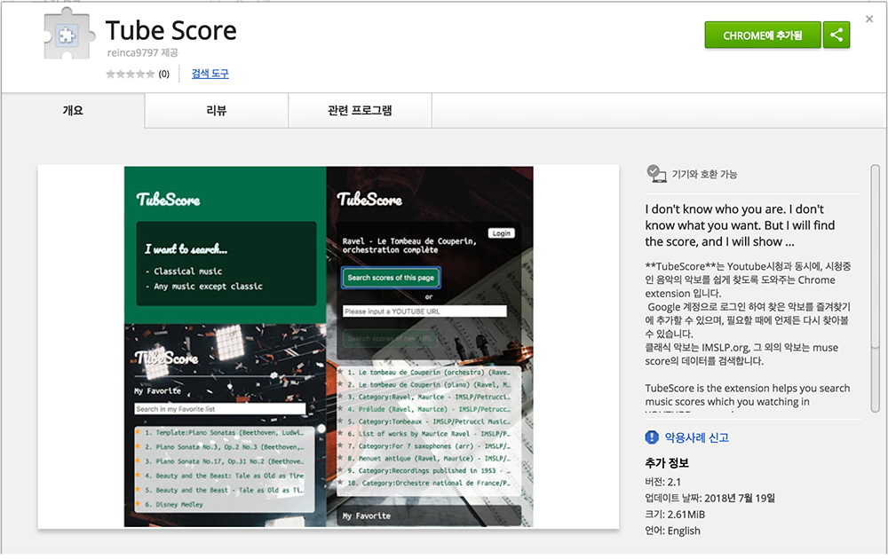

# Introduction

**TubeScore**는 **Youtube**시청과 동시에, 시청중인 음악의 악보를 쉽게 찾도록 도와주는 **Chrome extension** 입니다.
**Google** 계정으로 로그인 하여 찾은 악보를 즐겨찾기에 추가할 수 있으며, 즐겨찾기에 저장한 악보는 필요할 때에 언제든 다시 찾아볼 수 있습니다.



## Requirements

- TubeScore는 Google API를 사용했습니다.
- 클래식 음악은 **IMSLP.org**에서, 그 이외는 **Muse Score**에서 검색된 결과를 보여줍니다.
- 즐겨찾기를 사용하려면 Google 계정이 필요합니다.
- Chrome Browser에서 확장 프로그램 추가 설치 뒤 사용 가능합니다.

## Installation

 ```
 git clone git clone https://reinca@bitbucket.org/reinca/tube-score.git
 cd new-tube-score
 npm install
 npm start

 npm build
 Chrome 확장프로그램 관리 >압축해제된 프로그램 로드 > extension 버튼 생성 확인
 ```

 - Google web stroe > TubeScore 검색 > Chrome extension 설치


## Features

- Google 계정을 이용한 로그인 구현
- Google 계정으로 즐겨찾기 리스트 연동
- Classic 악보 검색 시 keyword Selector로 정확도 높임
- 즐겨찾기 항목 내 search
- 현재 방문 페이지 혹은 URL 입력을 통한 검색
- 실시간 즐겨찾기 리스트 추가/삭제


## Client-Side

- 모던 자바스크립트(ES2015+)
- React, Webpack을 사용한 컴포넌트 베이스 UI 아키텍처 구현
- HTTP Client 라이브러리는 Promise 베이스의 axios
- xml parsing 을 위한 xml2js 라이브러리 사용
- CSS는 별도의 프레임워크를 사용하지 않았습니다.


## Server-Side

- Google firebase의 실시간 database 사용


## Version Control

- Web, Server의 독립적인 관리를 위한 GIT Repo 구분
- Branch, Pull Request 기반 개발 진행


## Collaboration Tool

- Trello 스케쥴 관리


## Things to do

- Favorite 항목 folder로 정리 기능
- YOUTUBE tag detector & Search
